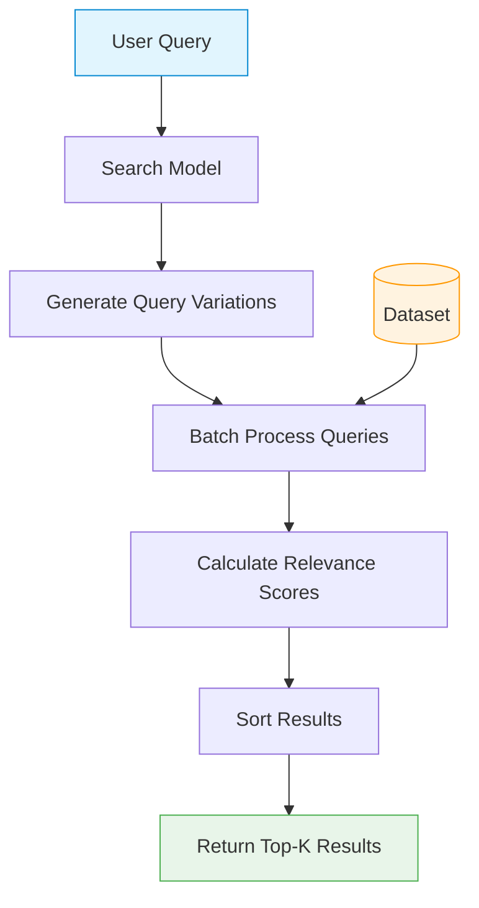

# Models API

This page documents the search model components of AniSearch Model.

## Overview

The models package contains the classes responsible for loading datasets, initializing cross-encoder models, and performing semantic search operations.

The package is structured as follows:

- `BaseSearchModel`: Abstract base class providing common functionality
- `AnimeSearchModel`: Implementation for anime search
- `MangaSearchModel`: Implementation for manga search (with optional light novel support)

## Model Search Workflow

The search process works by comparing a user query against all entries in the dataset:

This process ensures efficient and accurate retrieval of relevant content based on semantic understanding rather than simple keyword matching.

## BaseSearchModel

The foundation class with core functionality:

::: src.models.base_search_model.BaseSearchModel
    options:
      show_root_heading: true
      show_source: true

## AnimeSearchModel

Specialized model for anime search:

::: src.models.anime_search_model.AnimeSearchModel
    options:
      show_root_heading: true
      show_source: true

## MangaSearchModel

Specialized model for manga search:

::: src.models.manga_search_model.MangaSearchModel
    options:
      show_root_heading: true
      show_source: true
