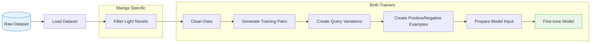
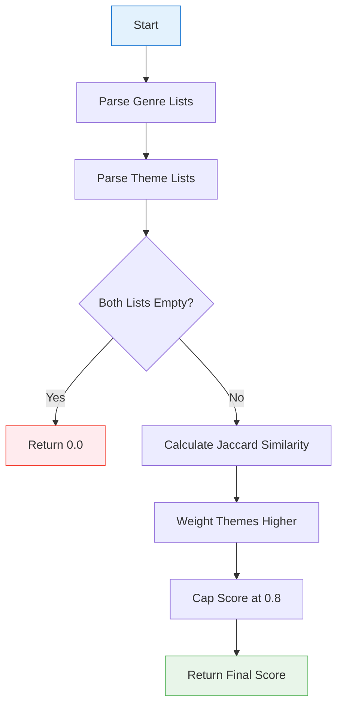

# Training API

This page documents the model training components of AniSearch Model.

## Overview

The training package provides functionality for fine-tuning cross-encoder models on anime and manga data. It includes:

- Base trainer class with common functionality
- Specialized trainers for anime and manga
- Dataset handling utilities
- Training utilities

## Data Processing Flow

The following diagram illustrates how data flows through the training process:

## Similarity Score Calculation

When generating synthetic training data, the system calculates similarity scores between entries based on their metadata:

This process ensures that synthetic training pairs reflect meaningful relationships between entries based on their genres and themes.

## Base Trainer

The foundation class with core training functionality:

::: src.training.base_trainer.BaseModelTrainer
    options:
      show_root_heading: true
      show_source: true

## Anime Trainer

Specialized trainer for anime models:

::: src.training.anime_trainer.AnimeModelTrainer
    options:
      show_root_heading: true
      show_source: true

## Manga Trainer

Specialized trainer for manga models:

::: src.training.manga_trainer.MangaModelTrainer
    options:
      show_root_heading: true
      show_source: true

## Dataset

Dataset implementation for cross-encoder training:

::: src.training.dataset.InputExampleDataset
    options:
      show_root_heading: true
      show_source: true

## Training Utilities

Helper functions for model training:

::: src.training.utils
    options:
      show_root_heading: false
      show_source: true
