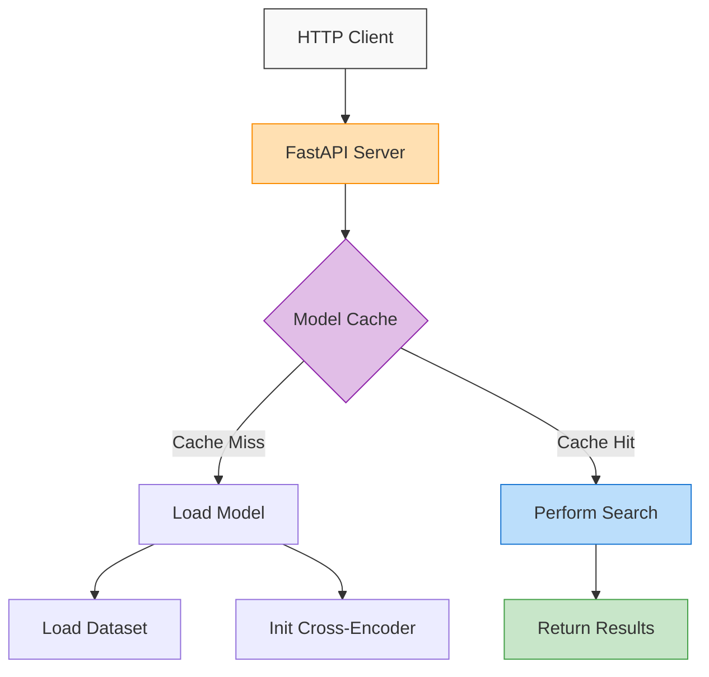

# API Server

The AniSearch Model includes a powerful REST API server built with FastAPI that allows you to integrate the semantic search capabilities into your applications through HTTP requests.

## Overview

The API server provides endpoints for searching anime and manga databases using the same cross-encoder models available in the command line interface. It's designed to be:

- **Fast and Efficient**: Built on the high-performance FastAPI and Uvicorn
- **Production-Ready**: Configurable CORS, multi-worker support, and route restrictions
- **Developer-Friendly**: Interactive OpenAPI documentation at `/docs`
- **Flexible**: Configurable for various deployment scenarios

## Getting Started

### Installation

Ensure you have all the necessary dependencies installed:

```bash
pip install -r requirements.txt
```

### Starting the Server

To start the API server with default settings:

```bash
python -m src.api
```

This will start the server on `0.0.0.0:8000` with default settings.

### Accessing the API

Once the server is running, you can:

1. Visit `http://localhost:8000/docs` for interactive API documentation
2. Make direct HTTP requests to the available endpoints

## API Endpoints

| Endpoint           | Method | Description                              |
|--------------------|--------|------------------------------------------|
| `/`                | GET    | Health check and CUDA availability       |
| `/models`          | GET    | List available models and fine-tuned models |
| `/search/anime`    | POST   | Search for anime matching a description  |
| `/search/manga`    | POST   | Search for manga matching a description  |

## Server Configuration

The API server provides numerous configuration options to customize its behavior:

```bash
# Basic configuration
python -m src.api --host=127.0.0.1 --port=8000

# Performance tuning
python -m src.api --workers=4 --limit-concurrency=100 --timeout=60

# CORS configuration
python -m src.api --cors-origins="https://myapp.com,https://admin.myapp.com" --cors-methods="GET,POST"

# Route restrictions for production
python -m src.api --enable-routes=search,health
```

### Configuration Options

| Option               | Description                                   | Default       |
|----------------------|-----------------------------------------------|---------------|
| `--host`             | Host to bind the server to                    | `0.0.0.0`     |
| `--port`             | Port to bind the server to                    | `8000`        |
| `--workers`          | Number of worker processes                    | Half of CPUs  |
| `--limit-concurrency`| Maximum number of concurrent connections      | `50`          |
| `--timeout`          | Timeout for keep-alive connections (seconds)  | `30`          |
| `--cors-origins`     | Allowed origins for CORS                      | `*` (all)     |
| `--cors-methods`     | Allowed HTTP methods for CORS                 | `*` (all)     |
| `--cors-headers`     | Allowed HTTP headers for CORS                 | `*` (all)     |
| `--enable-routes`    | Comma-separated list of routes to enable      | `all`         |

## Usage Examples

### Health Check

```bash
curl -X GET "http://localhost:8000/"
```

Response:

```json
{
  "status": "healthy",
  "models_loaded": {
    "anime": true,
    "manga": true
  },
  "cuda_available": true
}
```

### List Available Models

```bash
curl -X GET "http://localhost:8000/models"
```

Response:

```json
{
  "models": {
    "Semantic Search": {
      "cross-encoder/ms-marco-MiniLM-L-6-v2": "Recommended for general search",
      "cross-encoder/ms-marco-MiniLM-L-12-v2": "More accurate but slower"
    }
  },
  "fine_tuned": {
    "anime-v1": "model/fine-tuned/anime-v1"
  }
}
```

### Search for Anime

```bash
curl -X POST "http://localhost:8000/search/anime?model_name=cross-encoder/ms-marco-MiniLM-L-6-v2&device=cuda" \
  -H "Content-Type: application/json" \
  -d '{"query": "A story about robots and AI", "num_results": 3}'
```

Response:

```json
{
  "results": [
    {
      "id": 1023,
      "title": "Ghost in the Shell: Stand Alone Complex",
      "score": 0.892,
      "synopsis": "In the not so distant future, mankind has advanced..."
    },
    {
      "id": 43,
      "title": "Ghost in the Shell",
      "score": 0.857,
      "synopsis": "In the year 2029, the barriers of our world have been broken..."
    },
    {
      "id": 851,
      "title": "Ergo Proxy",
      "score": 0.813,
      "synopsis": "Within the domed city of Romdo lies one of the last human..."
    }
  ],
  "execution_time_ms": 156.32,
  "device_used": "cuda"
}
```

### Search for Manga with Light Novels Included

```bash
curl -X POST "http://localhost:8000/search/manga?include_light_novels=true" \
  -H "Content-Type: application/json" \
  -d '{"query": "A fantasy adventure in a magical world", "num_results": 3, "batch_size": 64}'
```

## Production Deployment

For production deployment, consider the following best practices:

1. **Restrict Routes**: Use `--enable-routes=search,health` to only expose necessary endpoints
2. **Configure CORS**: Set `--cors-origins` to your application domains
3. **Set Worker Count**: Adjust `--workers` based on your server's CPU cores
4. **Use HTTPS**: Deploy behind a reverse proxy like Nginx with HTTPS
5. **Monitor Performance**: Adjust concurrency limits based on server capabilities

### Example Production Configuration

```bash
python -m src.api \
  --host=127.0.0.1 \
  --port=8000 \
  --workers=4 \
  --enable-routes=search,health \
  --cors-origins="https://yourdomain.com" \
  --limit-concurrency=200 \
  --timeout=60
```

## Advanced Usage

### Using GPU Acceleration

The API supports GPU acceleration for faster query processing. To use a GPU:

1. Ensure you have PyTorch installed with CUDA support
2. Specify `device=cuda` in your API requests
3. Monitor GPU memory usage to optimize worker count

### Custom Models

You can use fine-tuned models by specifying the model path in the API request:

```bash
curl -X POST "http://localhost:8000/search/anime?model_name=model/fine-tuned/anime-v1" \
  -H "Content-Type: application/json" \
  -d '{"query": "A story about robots and AI"}'
```

## API Architecture

The AniSearch API server implements a caching layer to avoid reloading models between requests:


