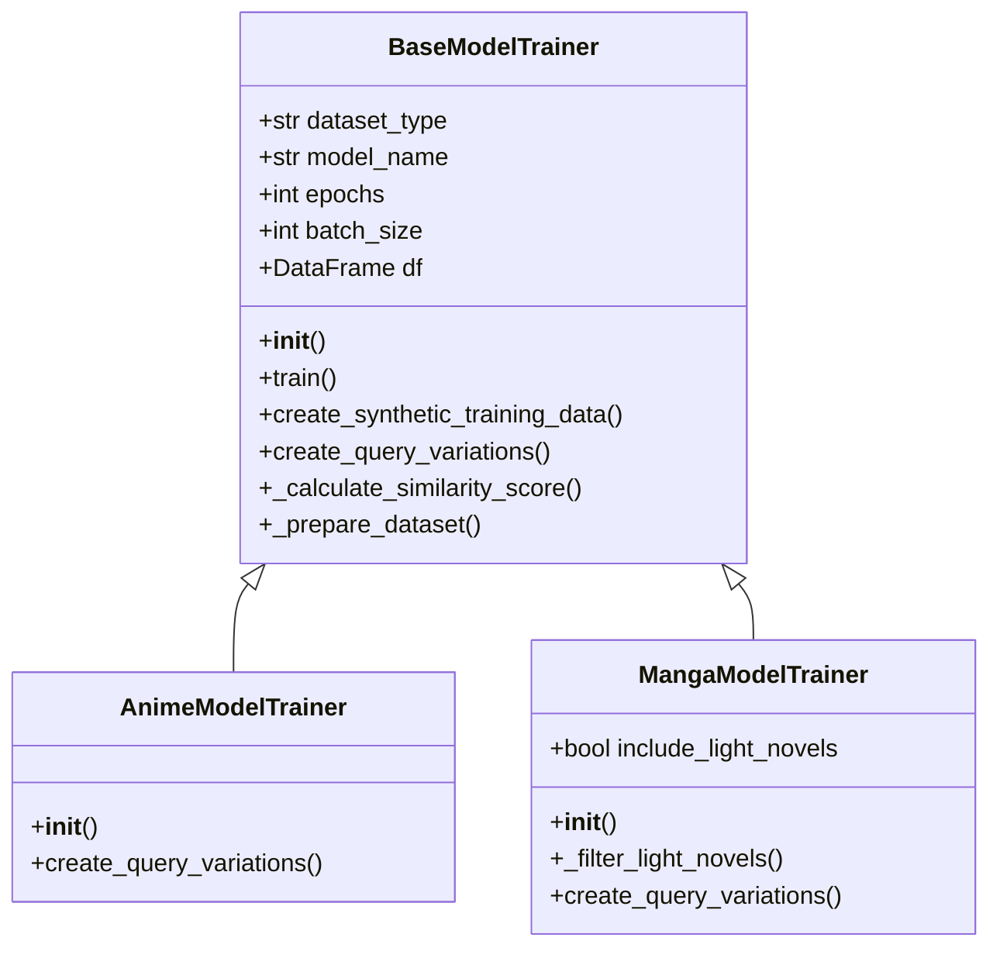
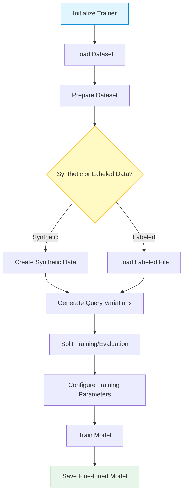

# Models & Architecture

AniSearch Model uses cross-encoder transformer models to compare query descriptions with anime and manga synopses. This page explains the architecture and models used in the project.

## Cross-Encoder Architecture

Unlike bi-encoders that encode query and document separately, cross-encoders:

1. Take both the query and document as a single input sequence
2. Apply self-attention across the entire sequence
3. Produce a single relevance score

This approach yields higher accuracy for relevance ranking but is computationally more expensive than bi-encoders.

```text
Query: "A story about pirates searching for treasure"
Document: "One Piece is a manga about a pirate crew searching for the ultimate treasure..."

Cross-Encoder Input: 
[CLS] A story about pirates searching for treasure [SEP] One Piece is a manga...

Output: Relevance Score (e.g., 0.92)
```

## Class Hierarchy

The model implementation follows a hierarchical class structure:



## Pre-trained Models

AniSearch Model supports various cross-encoder models from the Sentence Transformers library:

### MS Marco Models

Models trained on the MS MARCO passage ranking dataset are especially effective:

| Model Name | Size | Speed | Accuracy | Notes |
|------------|------|-------|----------|-------|
| `cross-encoder/ms-marco-MiniLM-L-6-v2` | 80MB | Fast | Good | Default model |
| `cross-encoder/ms-marco-MiniLM-L-12-v2` | 120MB | Medium | Better | More accurate but slower |
| `cross-encoder/ms-marco-TinyBERT-L-2` | 20MB | Very Fast | Basic | For low-resource environments |

### Other Compatible Models

Any cross-encoder model from Hugging Face can be used, including:

- `cross-encoder/ms-marco-electra-base`
- `cross-encoder/nli-deberta-v3-base`
- `cross-encoder/nli-roberta-base`

## Fine-tuned Models

When you train a model using the `train` command, AniSearch Model saves fine-tuned models to `model/fine-tuned/` with timestamp-based naming:

```text
model/fine-tuned/anime-model-2023-10-25-12-30-45/
model/fine-tuned/manga-model-2023-10-26-09-15-30/
```

## Model Selection Considerations

When choosing a model, consider:

1. **Speed vs. Accuracy**: Larger models are more accurate but slower
2. **Resource Constraints**: Smaller models require less memory
3. **Dataset Specificity**: Fine-tuned models perform better on specific domains

## Architecture Details

### Search Process Flow

The following diagram illustrates how the search process works from query input to ranked results:


1. **User Query Processing**:
    - Tokenize the natural language query
    - Apply any necessary preprocessing

2. **Cross-Encoder Scoring**:
    - Batch process query against all dataset entries
    - Compute relevance scores for each (query, synopsis) pair

3. **Result Ranking**:
    - Sort results by relevance score
    - Return top-k results

### Training Process Flow

The training process involves several important steps:



1. **Data Preparation**:
    - Create positive and negative pairs
    - Apply augmentation techniques (query variations)

2. **Fine-tuning**:
    - Initialize with pre-trained weights
    - Train using Mean Squared Error or Cosine loss
    - Apply learning rate scheduling

3. **Evaluation**:
    - Measure model performance on validation set
    - Save best performing model checkpoints
